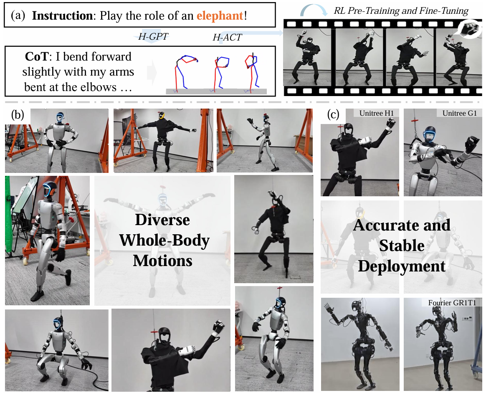
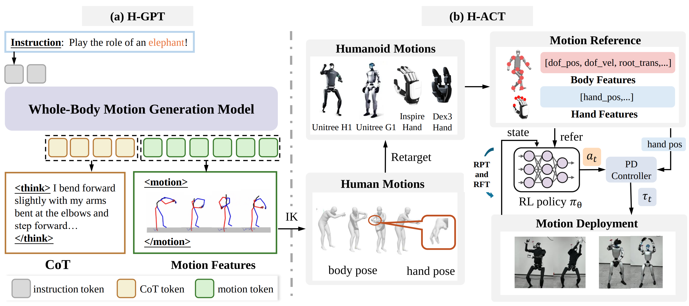
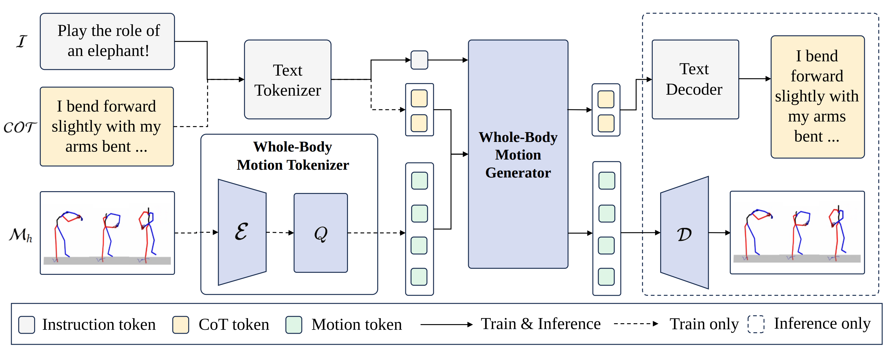
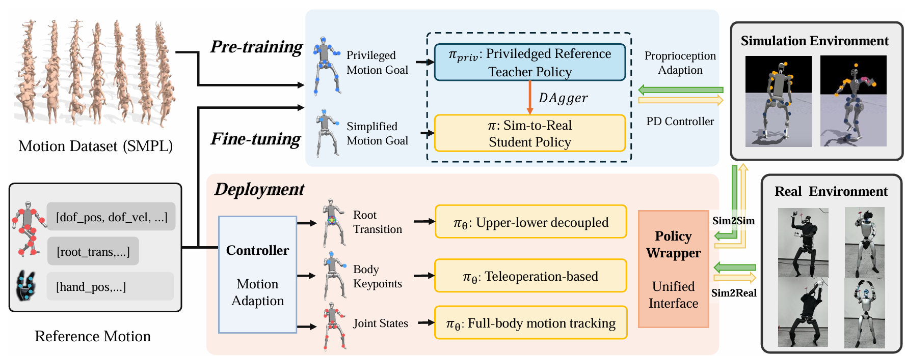

# FRoM-W1: Towards General Humanoid Whole-Body Control with Language Instructions

<div align="center">
  

  The **H**umanoid **I**ntelligence Team from FudanNLP and OpenMOSS
</div>

<div align="center">
  <a href="https://github.com/OpenMOSS/FRoM-W1">💻Github</a>&emsp;<a href="https://huggingface.co/datasets/OpenMOSS-Team/FRoM-W1-Datasets">🤗Datasets</a>&emsp;<a href="https://huggingface.co/OpenMOSS-Team/FRoM-W1">🤗Models</a>
</div>

## Introduction
<div align="center">
  
</div>


Humanoid robots are capable of performing various actions such as greeting, dancing, and even backflipping. However, these motions are often hard-coded or specifically trained, which limits their versatility. 
In this work, we present **FRoM-W1[^1]**, an open-source framework designed to achieve general humanoid whole-body motion control using natural language. 
To universally understand natural language and generate corresponding motions, as well as enable various humanoid robots to stably execute these motions in the physical world under gravity, **FRoM-W1** operates in two stages: 
(a) **H-GPT**: Utilizing massive human data, a large-scale language-driven human whole-body motion generation model is trained to generate diverse natural behaviors.
We further leverage the Chain-of-Thought technique to improve the model’s generalization in instruction understanding. 
(b) **H-ACT**: After retargeting generated human whole-body motions into robot-specific actions, a motion controller that is pretrained and further fine-tuned through reinforcement learning in physical simulation enables humanoid robots to accurately and stably perform corresponding actions. 
It is then deployed on real robots via a modular simulation-to-reality module. 
We extensively evaluate our framework on the Unitree H1 and G1 robots, demonstrating successful language-to-motion generation and stable execution in both simulation and real-world settings. 
We fully open-source the entire **FRoM-W1** framework and hope it will advance the development of humanoid intelligence.

[^1]: **F**oundational Humanoid **Ro**bot **M**odel - **W**hole-Body Control, Version **1**

## Release Timeline
We will gradually release the paper, data, codebase, model checkpoints, and the real-robot deployment framework for **FRoM-W1** in the next week or two.

Here is the current release progress:
- [**2025/12/17**] We have released the **perturbed text data** (i.e., **δ-Humanml3d-X**) on **[HuggingFace Datasets](https://huggingface.co/datasets/OpenMOSS-Team/FRoM-W1-Datasets)**.
- [**2025/12/17**] We have released the code to train and evaluate other baselines: [text-to-motion](https://github.com/EricGuo5513/text-to-motion), [MLD](https://github.com/ChenFengYe/motion-latent-diffusion) and [MotionDiffuse](https://github.com/mingyuan-zhang/MotionDiffuse) on HumanML3D-X at [`baselines`](./baselines).
- [**2025/12/16**] We have released the code to train and evaluate the baseline [T2M-GPT](https://github.com/Mael-zys/T2M-GPT) on HumanML3D-X at [`baselines/T2M-GPT`](./baselines/T2M-GPT).
- [**2025/12/14**] We have released the **CoT data** of HumanML3D-X on **[HuggingFace Datasets](https://huggingface.co/datasets/OpenMOSS-Team/FRoM-W1-Datasets)**.
- [**2025/12/13**] We have uploaded the checkpoints for HGPT, Baselines (SMPL-X version of T2M, MotionDiffuse, MLD, T2M-GPT), and the SMPL-X Motion Generation eval model on **[HuggingFace Models](https://huggingface.co/OpenMOSS-Team/FRoM-W1)**.
- [**2025/12/10**] We have uploaded the initial version of the code for two core modules, **[H-GPT](./H-GPT/README.md)**  and **[H-ACT](./H-ACT/README.md)** !
- [**2025/12/10**] We have released our lightweight, modular humanoid-robot deployment framework [**RoboJuDo**](https://github.com/HansZ8/RoboJuDo)!
- [**2025/12/10**] We are thrilled to initiate the release of **FRoM-W1**!


## Usage

<div align="center">

</div>

The complete **FRoM-W1** workflow is illustrated above:

- **H-GPT**  
  Deploy **H-GPT** via command-line tools or a web interface to convert natural-language commands into human motion representations.  
  This module provides full training, inference, and evaluation code, and pretrained models are available on HuggingFace.

<div align="center">

</div>

- **H-ACT**  
  **H-ACT** converts the motion representations from H-GPT into SMPL-X motion sequences and further retargets them to various humanoid robots.  
  The resulting motions can be used both for training control policies and executing actions on real robots using our deployment pipeline.

<div align="center">

</div>

## Citation
If you find our work useful, please cite it for now in the following way:
```bibtex
@misc{FRoM-W1,
  author = {Peng Li, Zihan Zhuang, Yangfan Gao, Yi Dong, Sixian Li, Changhao Jiang, Shihan Dou, Zhiheng Xi, Enyu Zhou, Jixuan Huang, Hui Li, Jingjing Gong, Xingjun Ma, Tao Gui, Zuxuan Wu, Qi Zhang, Xuanjing Huang, Yu-Gang Jiang, Xipeng Qiu},
  title = {FRoM-W1: Towards General Humanoid Whole-Body Control with Language Instructions},
  url = {https://github.com/OpenMOSS/FRoM-W1},
  year = {2025}
}
```
Welcome to star⭐ our GitHub Repo, raise issues, and submit PRs!
